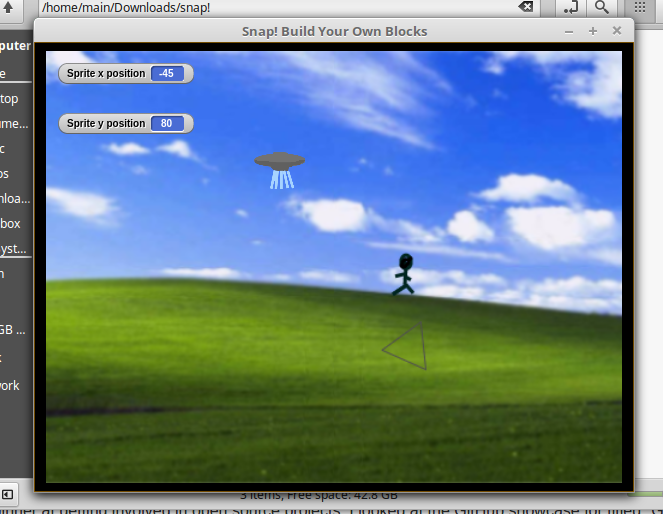

Do you have more suggestions for How To Answer Questions in a Helpful Way (from your past experience):
 -List at least two:
 1. Make sure to include enough information in your question that people don't have to ask more questions
just to figure out what the original question meant.
 2. If you have a deadline, work on time management so that you are not asking people questions soon before the deadline.
A lot of problems you can figure out on your own if you have enough time, and you want to avoid a situation where your question
is urgent and you make mistakes in your question like using "help me" and grovelling, which were advised against in the article.
This seemed to happen a lot during Data Structures.

  Please read the 10 criteria of Open Source Definition http://opensource.org/osd and understand why they are important.
 I read the 10 criteria and appreciate them more because of reading some of The Cathedral and the Bazaar. Being able to have any person work on a project, because they are interested in that project, sounds like a wonderful way of getting work done.

  Please read chapter 3 of Free Culture http://www.free-culture.cc/freeculture.pdf
 -Write a short paragraph ( 8 to 10 sentences) of what you got out of reading that chapter.
 Reading the chapter about the RPI student and reading some other parts of Free Culture made me feel like US laws along with precedents set by the supreme court too heavily favor patents and copyright laws. The fact that a large corporation such as the RIAA could sue a college student for all of his earnings, when he clearly has little power to fight such a large corporation and has accidentally committed a crime that can be fixed, seems absurd. The definition of Open Source seems more important after reading this. While there is good reason for people to have private property and be able to make money off of that property, there should also exist resources that can be accessed by anyone, no matter their background, to tinker with and learn from, or to just enjoy. This student's tinkering got him in serious legal trouble. The punishment for tinkering that results in accidental copyright infringement should be lessened, and this kind of behavior should actually be encouraged. Open source software provides a way for people to safely learn by being presented with projects they have free access to. Being forced into giving up all of your savings because of doing what college students are supposed to do, learning, is unjust.

  Install tree and get the directory structure.

 Please do all the practice problems given here (moving over Interactive Tutorial in the top right corner will get this).
 I did all 13 lessons.

 Do all the problems and at least four problems on beginner level here.

  Create some thing using either of the first two or solve this using blockly
 I used Snap! to make a little ufo game.

  
I made a game using Snap where there's a ufo and you have to hover over the person to take them as hostage. You can move the ufo with the up, down, right, and left keys.

  Reflection
 Since I am a beginner at getting involved in open source projects, I looked at the GitHub showcase for titled "Great for new contributors". Atom was one of those recommendations, and unlike some projects it has lots of issues so I should be able to find one that I work on. I use sublime as a text editor so I would want to familiarize myself with atom first.
