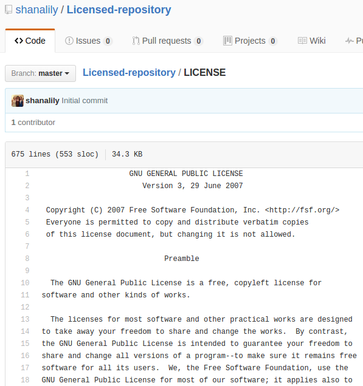

**Why it is important to choose a LICENSE?**

The license determines what other people can do with your software, so you should determine what freedoms people have with that software. For instance, if you believe it is morally unjust for people to not follow the four criteria of Free Software, you can have a free software license so that anyone can view and change the source code and distribute it with other users. If you want to copyright your work because you don't want other people to be do have the complete freedom to improve your work, you'll have to specify that with a license.

**Why is it important that you SHOULDN'T use a project that doesn't have an explicit license**

When a project is licensed as open source or something similar, you are being given permission in advance to change it and improve it. If the project is not licensed, you do not know what the creator's original intentions were for the use and distribution were of the project. You have not been given permission to touch their code and therefore you should not touch it.

**Do you agree with the claim in the Failure to follow the Open System Model Section of Why the Web beat Gopher?**

I agree with the claim that when Gopher did not embrace the open source model and pushed away developers, this prevented the advancement that was talked about by Raymond in the Cathedral and the Bazaar. The users of software have an incentive to improve it, and Gopher did not allow that, which allowed the Web to advance and become a better option for users than Gopher.

**Android uses the Apache license 2.0 and it's kernel uses GPL v2, Linux uses tge GPL v2 license, Microsoft .NET Core uses MIT license, SailfishOS is not open source. Can you justify why such a license is chosen (Justification for ONE is enough).**

Android uses the Apache license 2.0, which is a non-copyleft permissive license, and the base operating system is open-source. Android users can modify the source code, which is desirable since people use their phones all of the time and have the incentive. This gives Android a competitive edge against Apple, which is more restrictive. Some people are critical of Android since non-free software can be necessary for a properly running Android device. Android also uses the Linux kernel, though it is a separate program because the Apache license and GPL v2 are incompatible.

**Think of an example project. Pick a license (as a group) using the LICENSE chooser by Github.**

Our example project is an application or webpage where you can copy and paste a photo of a color or a pattern, and it comes up with colors and patterns that go with the image you picked. We wanted other people to be able improve it and share their improvements so that users of this program feel like the it picks good results and so that users feel like they have a good number of options to specify what kind of color scheme they are looking for. Therefore, we picked the GNU General Public License v3.0. Anyone will be able to modify and distribute the program as long as they follow certain rules, like making the source code available.

**Read these licenses GPL, LGPL and Apache/BSD and discuss which one will be better - for a developer, for a company and for the common good.**

A company would want to use an Apache license because it prevents random people from using the company's trademark. Therefore, the company can still work on their brand and have some claim to the work. Also, companies who modify the software do not have to share the source code, which private companies may find desirable. An LGPL would be good for a developer because they can use use libraries with an LGPL in their projects without having to release the source code. This means the developer can use integrate LGPL licensed software into applications that do not have to be distributed under GPL. A GPL would be best for the common good because all modifications and sofware including GPL-licensed code must be redistributed under GPL. This means that everyone has to share source code, installation information, among other requirements. This best fits the model of free software, which is considered the most ethical way to distribute software by many people.

**Create a repository and choose a license.**

I made a repository with a GPL v3 license.

**Write five sentences about choosing a project to work in this course and who will be users/customers and what license will you choose.**

One idea I had was to make a website or app where you can look up any topic you want to learn about and it will tell you all of the free resources you can use to learn that topic. This includes youtube tutorial channels, websites like khan academy that have lessons, and particularly useful blog posts, or even books (which people can usually get out of library. Users of this application would be people who need or want to learn a skill on their own and don't know where the best place to learn something is. Users would be able to make entries and rate different resources. I thought of this because I often have trouble figuring out where I want to go to learn a programming language and have to try numerous resources before I find one that I like.
I would use an MIT License because I'm fine with other people modifying and redistributing my code, but I'm also fine if people do not disclose the modified source code.

**Take 5 projects from Observatory or past RCOS Projects - create a table which project has which license.**

| Website | License Present | License |
|---------|:---------------:|--------:|
| http://git.polaritech.com/Solum/Solum | Yes | MIT License https://en.wikipedia.org/wiki/MIT_License |
| http://www.weirdtube.wtf/ | Yes | MIT License https://en.wikipedia.org/wiki/MIT_License |
| https://github.com/samuelyuan/AtomForum | Yes | MIT License https://en.wikipedia.org/wiki/MIT_License |
| https://github.com/hotshot2162/EMPACplus | Yes | Apache License, Version 2.0 https://www.apache.org/licenses/LICENSE-2.0 |
| https://github.com/olivierpo/minebot | Yes | MIT License https://en.wikipedia.org/wiki/MIT_License |
