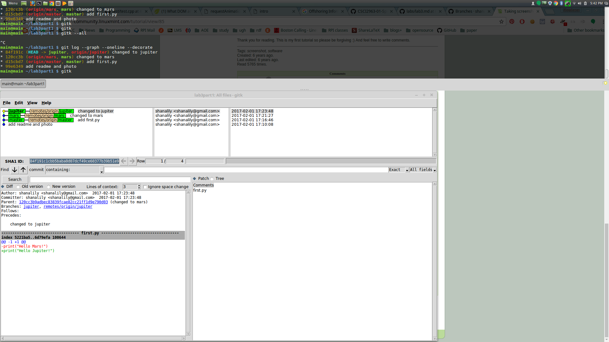

**link to lab3part1 repository** 
[lab3part1 repository](https://github.com/shanalily/lab3part1)

**screenshot of gitk**

**screenshot of Learn Git Branching**

**link to courseproject repository** 
[courseproject](https://github.com/shanalily/courseproject)

**link to table repository** 
[Table 8 repository](https://github.com/shanalily/Story-Spring2017)
