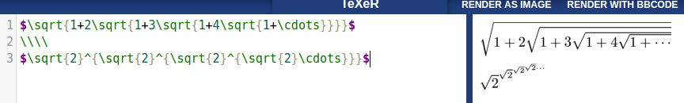
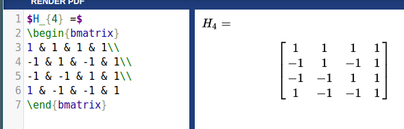

**Part 0 - Documentation** 
2. 
 
3 

**Part 1 - Community** 
minebot
* 1 contributor
* 600 total lines of code
* first commit - Initial commit, April 15, 2016
* latest commit - comm, May 6, 2016
* branches - master

MineBot-v2
* 1 contributor
* 963 total lines of code
* first commit - Initial commit, Oct 27, 2016
* latest commit - Update README.md, Dec 5, 2016
* branches - master

**Part 2 - Unit Testing** 
[markdown.py](https://github.com/shanalily/markdown.py/blob/master/markdown.py) 
[test_markdown_unittest.py](https://github.com/shanalily/markdown.py/blob/master/test_markdown_unittest.py)
