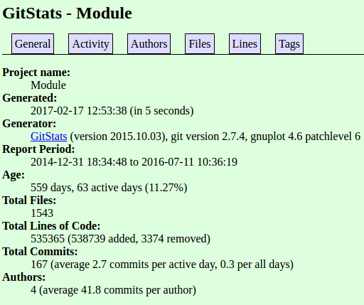

**Part 0 - Documentation** 
2. 
 
3 

**Part 1 - Community** 
1. 
minebot
* 1 contributor
* 600 total lines of code
* first commit - Initial commit, April 15, 2016
* latest commit - comm, May 6, 2016
* branches - master

MineBot-v2
* 1 contributor
* 963 total lines of code
* first commit - Initial commit, Oct 27, 2016
* latest commit - Update README.md, Dec 5, 2016
* branches - master

Module Game Engine
* 3 contributors
* 870871 total lines of code
* first commit - initial commit, Dec 31, 2014
* latest commit - Merge branch 'dev' of github.com:AaronPerl/Module into dev, July 11, 2016
* branches - dev, netcode, graphics testing, gh-pages, stable

MoleAI
* 1 contributor
* 8756296 total lines of code
* first commit- Added Building class, Nov 8, 2016
* latest commit - Tweaks, fixes, and functionality enhancement, Dec 18, 2016
* branches - master

Myo-Intelligesture
* 1 contributor
* 2442 total lines of code
* first commit - Initial commit, Oct 31, 2014
* latest commit - Make most private class variables const, April 5, 2015
* branches - master

2. 

The number of lines of code seems to usually be different in gitstats than the number of lines from the command line. One of the projects has 2 contributors in gitstats, but only one on the GitHub.

3. 
The leader of [minebot](https://www.youtube.com/watch?v=da8hRBlbe4A) is clearly Olivier Poulin. 
The leader of [MineBot-v2](https://www.youtube.com/watch?v=bVvWO6Gjk30) is Michael K. Duncan. 
The leader of [Module Game Engine](https://www.youtube.com/watch?v=pQQPvW7VscE&t=3s) is Aaron Perl. He started the project and most consistently worked on it. 
The leader of [MoleAI](https://www.youtube.com/watch?v=BO49mvTS_7w) is Mole. 
The leader of [Myo-Intelligence](https://www.youtube.com/watch?v=nQbPjY_pXxA) is Jordan Horwich. 

The image below is a screenshot from the Module Game Engine video. This project had more activity than others and actually had multiple contributors, so the images from the video are much more exciting.

The image below is from MoleAI, which clearly had a lot of activity in one specific directory.

**Part 2 - Unit Testing** 
[markdown.py](https://github.com/shanalily/markdown.py/blob/master/markdown.py) 
[test_markdown_unittest.py](https://github.com/shanalily/markdown.py/blob/master/test_markdown_unittest.py)
