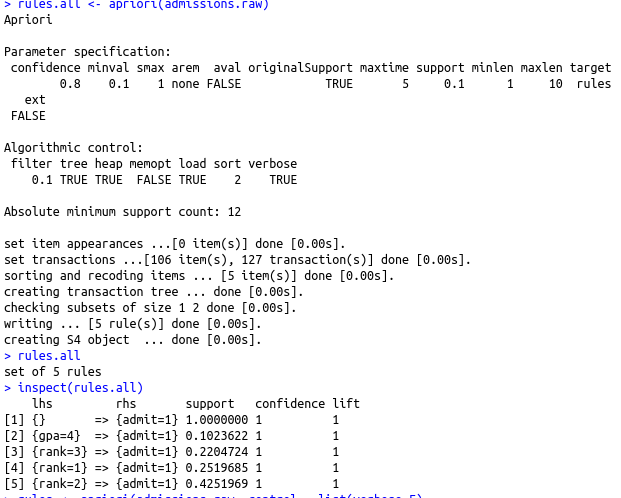
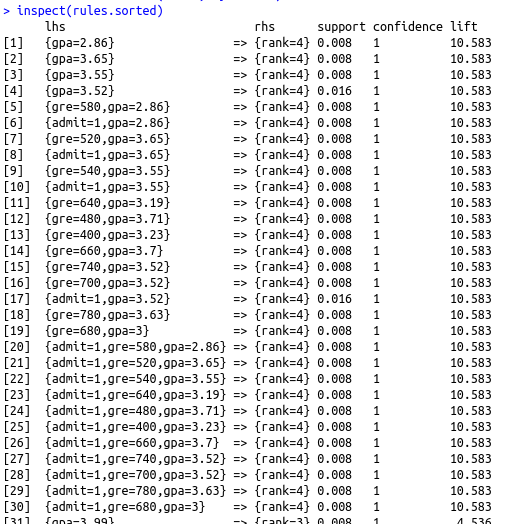
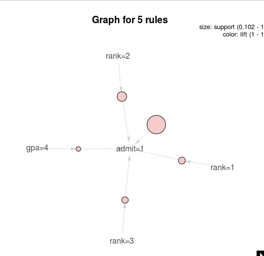
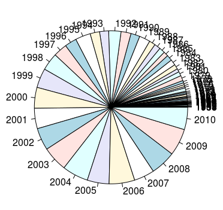
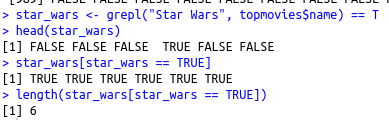
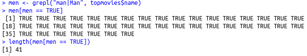
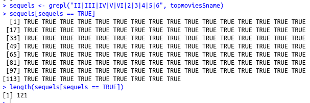
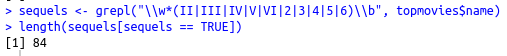
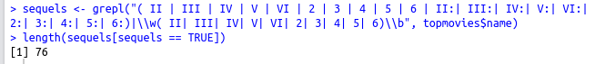

1. I read chapter 9 and downloaded to titanic data to use. 
2. I read the background on Association Rule mining and downloaded the two packages 
3.  
  
  
I was able to get rid of all of the redundant rules and cut down the number of rules by about 200. 
4.  
  
5.  
Bush/Kerry election data  
  
  
  
Below you can see which states Bush won by comparing Bush's points to Kerry's points. 
  
The number of states Bush won can be found by using the length function. 
  
Top movies data  
  
  
  
There are 6 Star Wars movies in the data set. 
  
There are 41 movies with the word man in the title. 
  
At first I thought there were 121 sequels. 
  
But then I thought I had to make sure the string was at the end of the word, in case there were numbers in the other parts of the title. 
  
Then I remembered that it could be in the middle of the word, I just had to make sure there was space around it or a colon after it. Also there should be a space before the number at the end of the movie title. 
 
This still is an underestimate, because some movies have titles that are harder to recognize as sequels, for instance the Harry Potter movies.  
6. optional 
7.  
At the time of this lab, I had spent some time learning Qt that week by watching and reading what I could find online and trying it myself. I have done more since, which I have written about in my first blog post. Right now, I am trying to figure out how to change path names depending on the operating system, so that opening a file is easier, and figuring out zoom and dimensions of the page, as well as how to display the index that some pdfs have. [Here](https://rcos.io/projects/shanalily/deepreader/profile) is the Observatory page.
