1. I read chapter 9 and downloaded to titanic data to use. 
2. I read the background on Association Rule mining and downloaded the two packages 
3.  
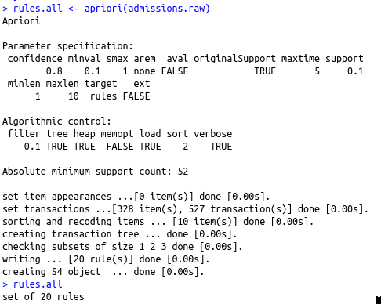  
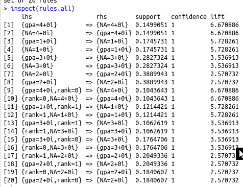  
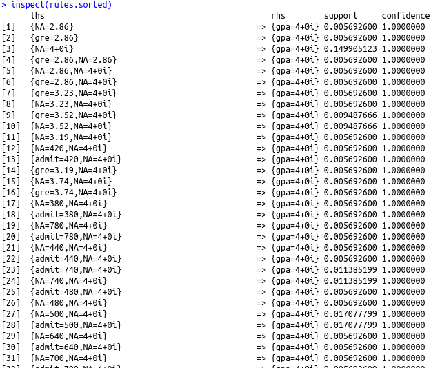  
4.  
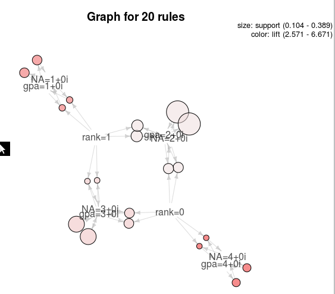  
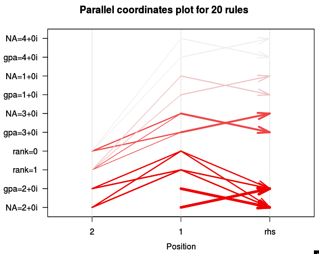  
5.  
Bush/Kerry election data  
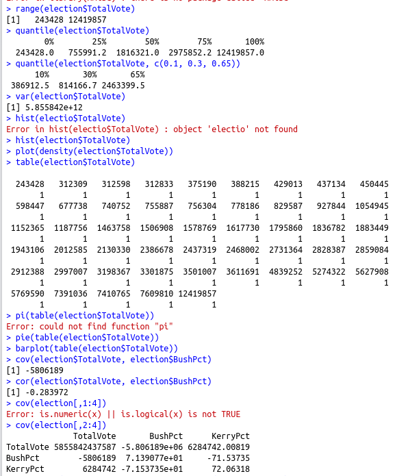  
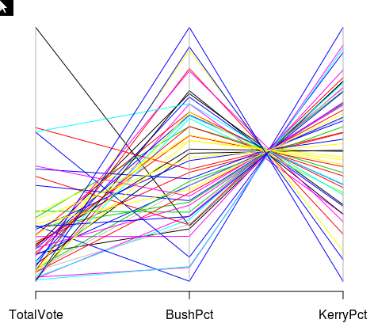  
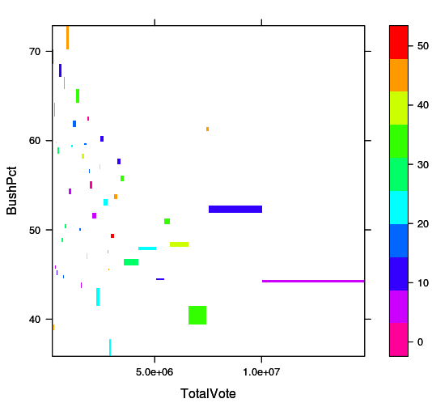  
Below you can see which states Bush won by comparing Bush's points to Kerry's points. 
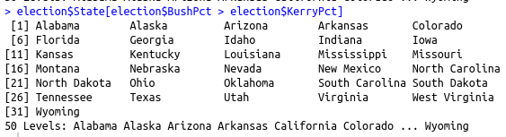  
The number of states Bush won can be found by using the length function. 
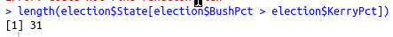  
Top movies data  
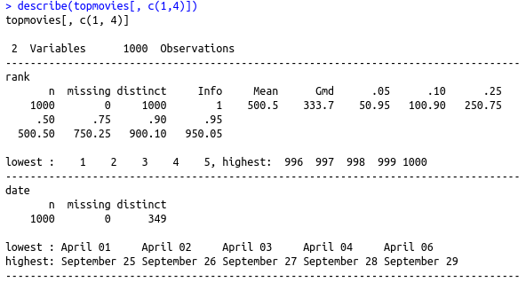  
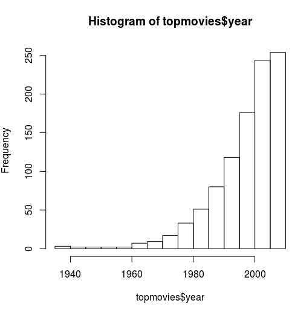  
6.  
7.  
